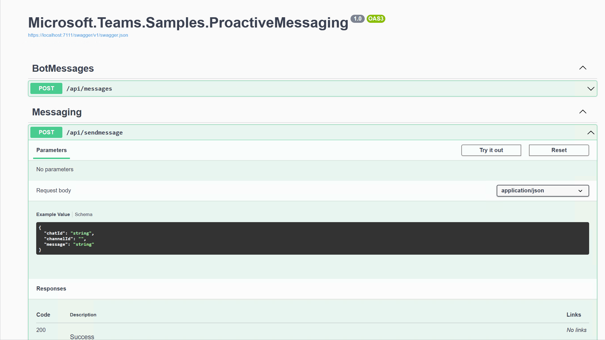

# Proactive Messages App for Microsoft Teams

This sample app allows you to send proactive messages to a group chat or channel in Microsoft Teams. Proactive messages are messages that are sent from your app to a user or group of users, without the user first initiating the conversation. 

The sample app code supports different teams environments - Commercial, GCC, GCCH and DOD.

## Prerequisites

- [.NET Core SDK](https://dotnet.microsoft.com/download) version 6.0

  ```bash
  # determine dotnet version
  dotnet --version
  ```
- Tunneling solutions such as [ngrok](https://ngrok.com/) or [Tunnel Relay](https://github.com/OfficeDev/microsoft-teams-tunnelrelay) 

## Setup

Clone the repository

To set up the sample app code, follow these steps:

1. Create an Azure bot registration and connect it to Teams Channel. [Learn More](https://learn.microsoft.com/en-us/microsoftteams/platform/bots/what-are-bots)

> Note: Bot registration should be done in
> * Azure Commercial (https://portal.azure.com) for Commercial and GCC environments.
> * Azure Government (https://portal.azure.us) for GCCH and DOD environments.
>
> [Learn more](https://learn.microsoft.com/en-us/azure/bot-service/how-to-deploy-gov-cloud-high?view=azure-bot-service-4.0&tabs=csharp).

2. Create an application secret for the app registered in step 1. Copy the App Id and App Secret.
3. Rename the app settings file for the desired environment to 'AppSettings.json' (Example for GCCH, rename AppSettingsGCCH.json to AppSettings.json)
4. Update the Microsoft App Id and App Secret in the app settings file.
5. Run the .NET project in an IDE (like Visual Studio) or `dotnet run`.
6. Use a tunneling solution like ngrok and point it to port 7111: `ngrok http -host-header=rewrite 7111` 

Make sure to copy and save the HTTPS URL (it should look like `https://<randomsubdomain>.ngrok.io`).

7. Update the bot messaging endpoint in the Azure bot registration to the ngrok URL with messaging endpoint. (ex. `https://<randomsubdomain>.ngrok.io/api/messages`)

## Prepare the application package

To add the application to Teams client, follow these steps:

1. Update the manifest file in the App Package folder with the Microsoft App Id registered in the setup.
2. Package the manifest file along with icons into a zip file.
3. Side load or Upload the application to org catalog.

You are ready to send proactive messages now.

## Sending Proactive Messages

To send a proactive message, follow these steps:

1. Choose whether to send the message to a group chat or channel, and copy the conversation ID or channel ID.
2. Try out the "sendmessage" API from Swagger and update chat Id / channel Id, and the message you want to send and hit Execute.

The app should send the message.



## Limitations

Please note that this app can only send proactive messages to a group chat or channel in a team where the app is installed. It cannot send messages to individual users or to teams where the app is not installed.

> Note that this is a sample code to help you understand how you can send proactive messages in different Teams environments. The message controller API is not authenticated and is not recommended for production use.

## Support

If you have any questions or issues with the app, please create an issue in the repository.
